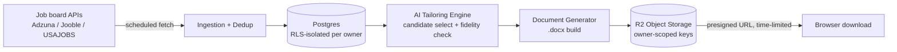
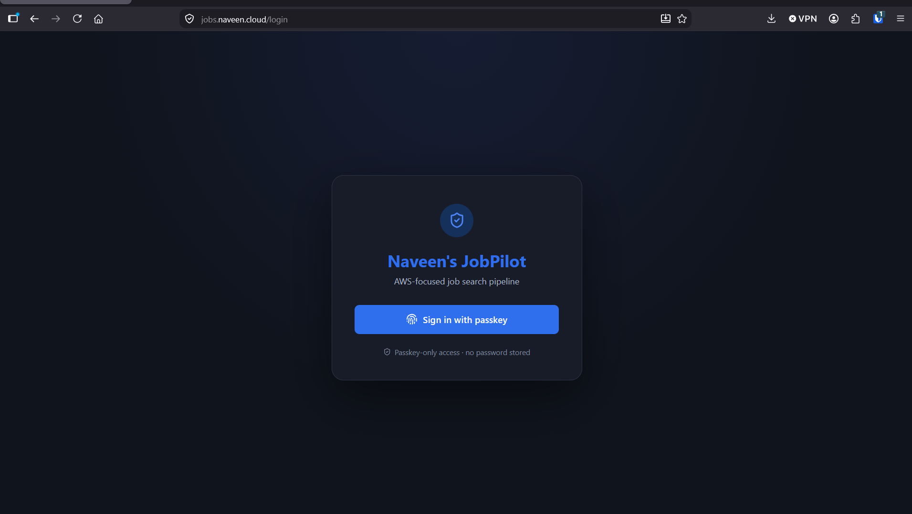
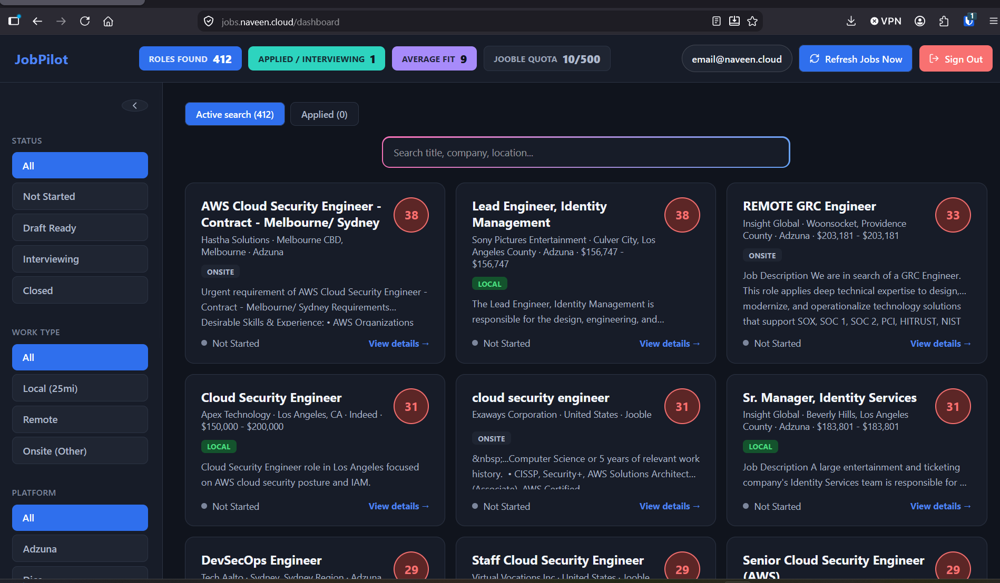
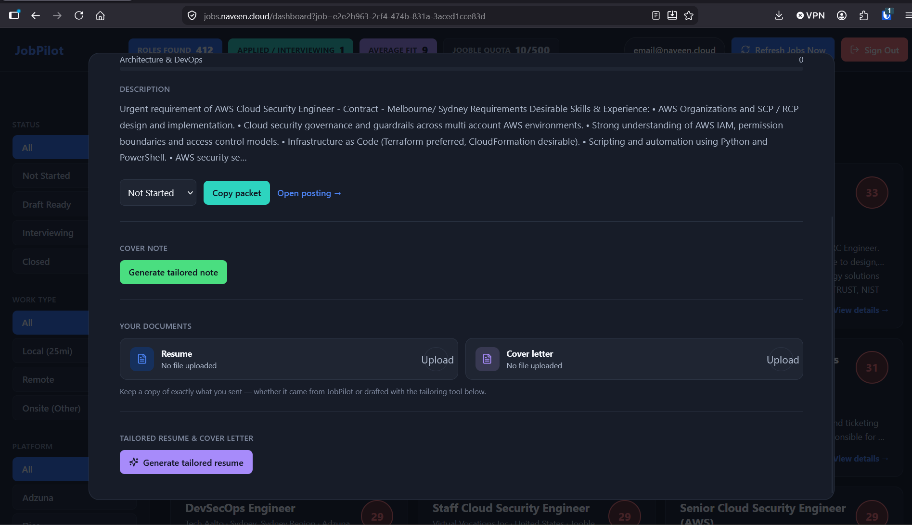

# JobPilot — Architecture Showcase

A personal job-search automation platform I built and use daily. This repo is a curated, redacted slice of the full private codebase — five files chosen specifically to demonstrate architecture and security decisions relevant to cloud/platform engineering and security-focused roles.

**Full app is private.** Happy to walk through the complete codebase directly with reviewer access on request.

---

## Why I built this

I was running my own job search — tracking applications, tailoring resumes per posting, pulling listings from multiple job boards — by hand. I automated it, and treated it as a real infrastructure project: multi-source data ingestion, tenant-isolated storage, AI-assisted content generation with guardrails against hallucination, and secure document handling.

## Stack

| Layer | What's used | AWS-equivalent pattern |
|---|---|---|
| Compute | Vercel (Next.js API routes) + GitHub Actions (scheduled) | Lambda + EventBridge |
| Database | Supabase (managed Postgres) | RDS/Aurora Postgres |
| Object storage | Cloudflare R2 (S3-compatible API) | S3 |
| Storage SDK | `@aws-sdk/client-s3` + `@aws-sdk/s3-request-presigner` (official AWS SDK, used against R2's S3-compatible endpoint) | Same SDK, same S3 |
| Tenant isolation | Postgres Row-Level Security | IAM resource policies / RLS on RDS |
| AI integration | DeepSeek API | Bedrock-style external inference call |

I'm AWS-certified (Security Specialty, Solutions Architect Associate, Cloud Practitioner) but built this on Supabase/Vercel/R2 for cost reasons on a personal project — the architectural decisions below translate directly to their AWS equivalents, and in the case of object storage, use the identical AWS SDK against an S3-compatible endpoint.

## System overview

---

## What each file demonstrates

### 1. `lib/r2.ts` — Object storage, least-privilege access pattern
Files are never made public and never proxied through app memory unnecessarily. Every read goes through a **time-limited presigned URL** (5-minute default expiry) rather than a permanently-public object or a static credential handed to the client. This is the same pattern as S3 presigned URLs — the client gets exactly the access it needs, for exactly as long as it needs it, with the actual R2/S3 credentials never leaving the server.

### 2. `app/api/jobs/resume-docx/route.ts` — Cache-first with graceful rebuild
Checks for an existing, valid stored object before doing any compute. If found, returns a fresh signed URL immediately — no regeneration, no unnecessary storage writes. If not found, builds the artifact, uploads it, persists the reference, and *then* returns the link. This avoids both wasted compute and stale-data bugs (see the fidelity notes in `tailoring.ts` below — cache invalidation is handled explicitly, not left implicit).

### 3. `lib/tailoring.ts` — Guardrails around a non-deterministic system
The core security-adjacent design problem here: an LLM is generating content that represents me to employers, and LLMs hallucinate. The architecture treats the model as **untrusted input**, the same way you'd treat any external API response:
- Deterministic, auditable pre-filtering happens *before* the model ever sees the data (the model can't invent an option it was never given)
- A post-call **fidelity check** validates that every number/metric in the model's output matches the verified source — any bullet that fails is silently reverted to the original, unaltered text
- A backstop guarantees no data silently disappears from the output even if the model's selection logic drops something unexpectedly

This is the same trust posture I'd apply to validating any third-party service response before it's persisted or displayed.

### 4. `lib/dedup.ts` — Catching a real correctness bug
A real bug I found in production: comparing raw job-posting URLs for deduplication failed, because the source API embeds a per-request tracking token in the query string on every call for the *same* underlying posting. Comparing full URLs treated identical postings as new every time. The fix normalizes to origin+pathname for comparison while preserving the original URL for click-through — a small, specific example of diagnosing a data-quality issue down to its root cause rather than patching the symptom.

### 5. `db/rls_jobs_policy.sql` — Defense in depth at the data layer
Every table enforces per-owner isolation via Postgres Row-Level Security — `auth.uid() = owner_id` on every operation. This means a bug in application code (e.g. a missing filter in a route handler) **cannot** leak another user's data, because the database itself refuses the query. This is the same principle behind least-privilege IAM policies and resource-based access control: authorization enforced at the resource, not trusted to be correctly re-implemented in every code path that touches it.

---

## Relevant certifications

- AWS Certified Security – Specialty (SCS-C02)
- AWS Certified Solutions Architect – Associate (SAA-C03)
- AWS Certified Cloud Practitioner (CLF-C02)

## Screenshots

*(from my personal deployment — not a public demo)*

**Passkey-only login** — no passwords stored, WebAuthn end to end.

---

**Dashboard** — live job feed with per-posting fit scoring, source/platform filters, and application status tracking.

---

**Job detail view** — job description, document tracking, and the AI tailoring trigger for that specific posting.

---

## License

MIT — see [LICENSE](./LICENSE).
